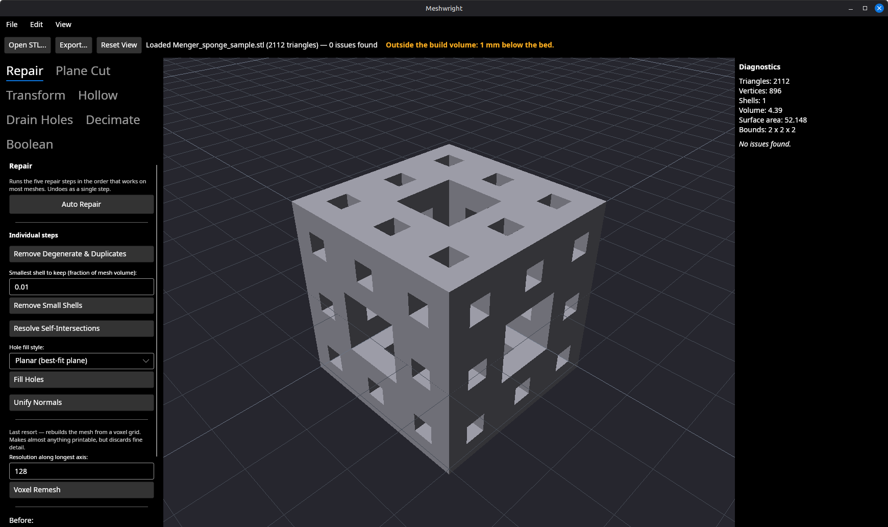
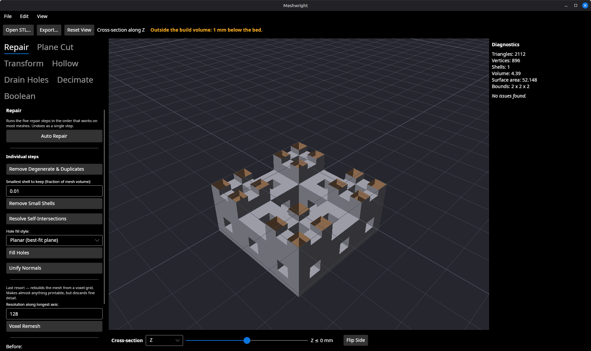
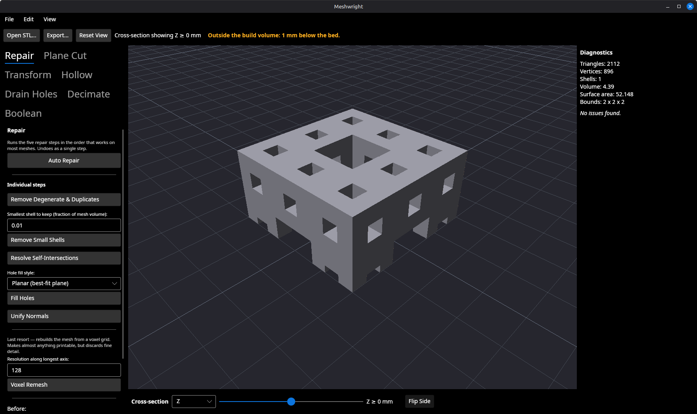
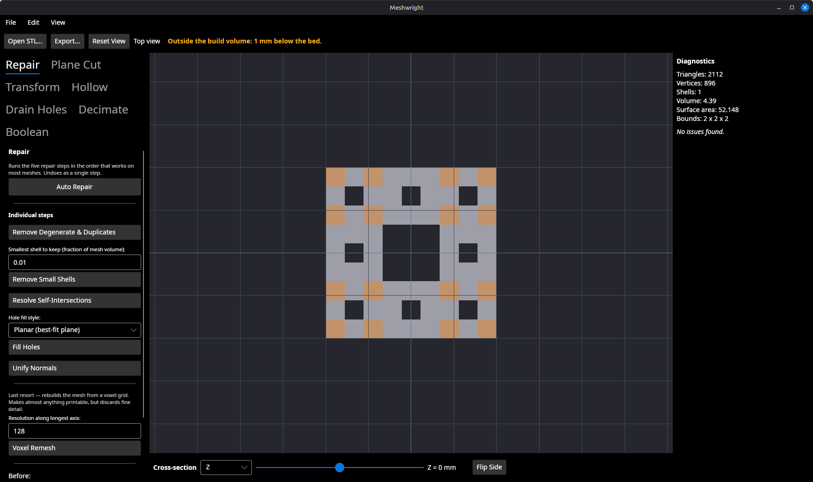
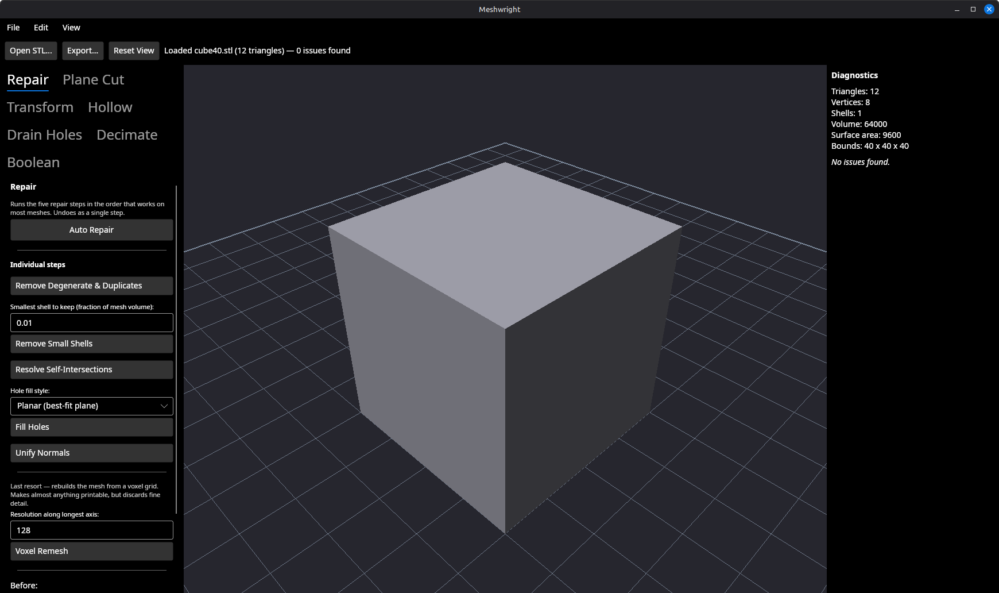
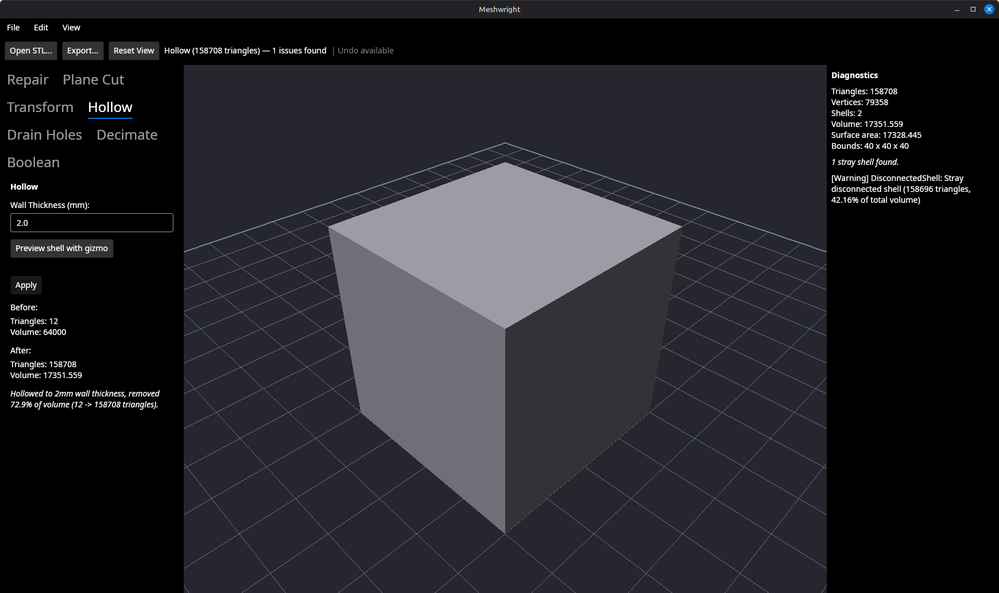
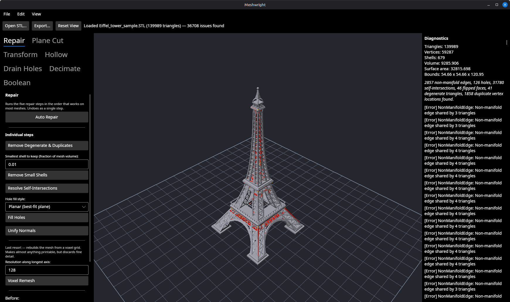
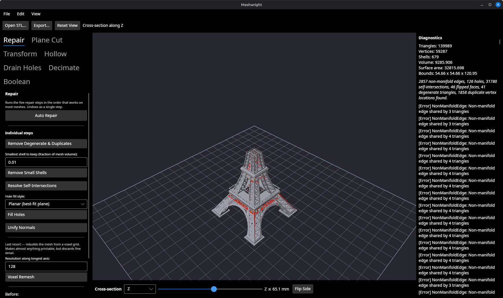
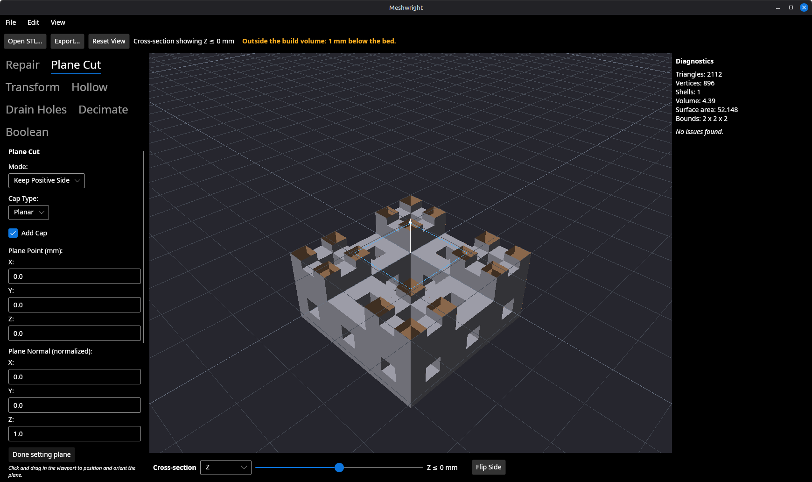

# Cross-section preview slider — backlog item 23, slice 3

**Branch:** `feat/viewport-cross-section`
**Date:** 2026-09-06
**Tests:** 742 unit passing, 0 skipped (baseline 722). GPU 28 passing (baseline 22).

The third slice of §5.1's Viewport / UX block. `View → Cross-Section`
(`Ctrl+Shift+C`) opens a bar under the viewport with an axis picker, a slider in
millimetres and a Flip Side button; everything on one side of the plane stops
being drawn, so the inside of the model is visible without a triangle changing.

---

## What it looks like

The clean Menger sponge sample, before and after `Ctrl+Shift+C`. Same camera,
same mesh, same 2112 triangles and "No issues found" in the diagnostics panel —
the only difference is which fragments reach the screen.





Flip Side keeps the other half instead. The readout changes with it — this is
why it reads `Z ≤ 0 mm` rather than `Z = 0 mm`, since the latter is equally true
of both halves and could not tell you which one Flip Side just gave you.



Viewed from the top in orthographic, the section reads as the sponge's plan at
that height, with the through-holes as background:



---

## The case it was built for: is my wall thick enough?

A 40 mm cube hollowed to a 2 mm wall. From the outside, the hollowed model is
indistinguishable from the solid one — that is the entire problem.






---

## Scale: the 139,989-triangle tower

The section is a fragment discard. Nothing is re-uploaded when the plane moves —
`MeshViewportControl.CrossSection` only calls `RequestNextFrameRendering()`, and
`MeshRenderer.UploadMesh` is not on that path — so the cost does not depend on
triangle count. Dragged continuously across the Eiffel tower sample (139,989
triangles, 36,708 issues) it tracked the pointer with no perceptible lag.





---

## Decisions

**Where it goes in the render order — it is not a fourth pass.** The viewport
had three passes in a deliberate order (build plate, mesh, gizmo). A section is
not a fourth one: it hides part of an existing pass. The mesh pass and its
flagged-edge overlay both discard fragments in the hidden half-space; the two
passes around them are deliberately left alone.

- The **build plate is not clipped.** It is the reference the model is measured
  against, and sawing the bed in half removes the thing the section is relative
  to.
- The **gizmo is not clipped.** It is an overlay drawn on top of everything with
  the depth test off. Clipping it would make the plane cut handle disappear at
  exactly the moment a user opens the model to aim it — which is the workflow
  the two features are best at together:



**There is no cap on the cut face, and that is a measured constraint rather than
an oversight.** The textbook way to cap a clipped solid is stencil parity, and
the framebuffer Avalonia hands `OnOpenGlRender` has no stencil attachment. That
was not assumed — it was asked:

```
PROBE fb=1 stencilSize=0 depthSize=24 err=InvalidOperation
```

(`glGetFramebufferAttachmentParameteriv` on the live app's FBO. `InvalidOperation`
on the stencil query is itself the answer: there is no stencil attachment to
describe.) Capping therefore means either an offscreen render target of our own
plus a blit, or re-extracting the cross-section on the CPU for every slider
position — a slice of its own either way, and the second would give up the
triangle-count independence that makes the slider draggable on the tower. What
ships is honest about being a way of *looking* into the model rather than a
picture of the cut face; the exact, capped cross-section already exists one
click away as Plane Cut with Add Cap, which the preview is good at aiming.
Logged as a follow-up in the backlog.

**Back faces are shaded and tinted only while a section is open.** Opening a
model puts its inward-facing surfaces in view, and those shade to the ambient
floor — the opened model reads as a black hole. Under a section the normal is
flipped and the surface tinted, so the interior is lit and still distinguishable
from the outside. Doing it unconditionally would have been a regression: a back
face on a closed mesh is what an inverted normal looks like, and the viewport
showing it dark is a diagnostic this app exists to provide.
`TheInteriorTintIsAppliedOnlyWhileASectionIsOpen` pins both halves of that.

**One control per piece of state.** The axis and position live on the bar, not
mirrored into the View menu, so there is no second copy to drift out of step
with the plane being drawn.

---

## A defect found by looking at the running app

The suite was green and the feature demonstrably worked on the sponge. Opening
the hollowed cube and pressing `Ctrl+Shift+C` gave this:


The position is a world millimetre, and it had been carried over from the sample
tetrahedron loaded at startup. It was inside the cube's range, so the existing
clamp — which only re-centres a position that falls *outside* the model — left it
alone. Switching the section on now always re-centres on whatever is loaded, and
`SwitchingItOn_OpensTheModelDownTheMiddleOfWhateverIsLoadedNow` fails on the old
behaviour. No property test would have found this; the arithmetic was right the
whole time.

---

## How it was verified

**742 unit tests, 0 skipped** (`dotnet test tests/Meshwright.Tests -c Release`),
and **28 GPU tests** in 0.45 s under `timeout`.

The GPU tests read the framebuffer because there is nothing else to read: the
section lives entirely inside the fragment shaders, so no CPU-side state can
tell you whether the plane on screen is the plane that was asked for.

- `ThePlaneLandsAtTheWorldMillimetreItWasGiven` — front orthographic on a 40 mm
  box, so a pixel row *is* a Z coordinate; the topmost drawn row must be the
  projection of the section position, to within two pixels, at three different
  positions.
- `TheSectionRemovesThePartOfTheModelBeyondThePlane_AndNothingElse` — a quarter
  of the box's height must leave roughly a quarter of its pixels. A bare
  inequality passes just as happily when the clip is inverted.
- `FlippingKeepsTheOtherHalf_AndTheTwoHalvesTogetherAreTheWholeModel` — every
  pixel of the whole model in exactly one half, and neither half painting
  anywhere the whole model does not.
- `TheFlaggedEdgeOverlayIsClippedWithTheSurfaceItMarks` — the overlay is a
  separate shader program; clipping one and not the other leaves yellow
  wireframe hanging over geometry that is gone.

Each of these was checked against a broken build rather than assumed to work:
inverting the clip sign in the surface shader fails the first two, and dropping
the edge program's uniforms fails the fourth. The rest of the suite stays green
under both mutations, which is the point — they are testing different things.

The window-level tests drive `Ctrl+Shift+C` through `KeyPressQwerty` rather than
raising `Click`, because Avalonia does not update a menu item's `IsChecked` on
`HotKey` activation and a `Click`-based test cannot see that class of bug (it is
what made `Ctrl+Shift+B` a silent no-op). The slider and axis picker are
subscribed on their Avalonia properties rather than the `ValueChanged` /
`SelectionChanged` routed events, which do not fire outside a visual tree — the
trap that let the drain-hole gizmo ship placing every hole at a hard-coded 2 mm.
Every window-level assertion ends at `MainWindow.ActiveCrossSection`, the plane
the viewport is actually drawing, not at the slider's own value.

## Not this slice

- **No cap on the cut face.** Reasoning above; added to the backlog.
- **No section gizmo.** The plane is dragged by a slider, which is what §5.1
  names. Given the gizmo-first direction, a draggable in-viewport section plane
  is worth considering later — noted, not built.
- **Item 26 was not exercised.** Nothing here splits a mesh, so the 1,808-issue
  result on a split sponge did not come up.
