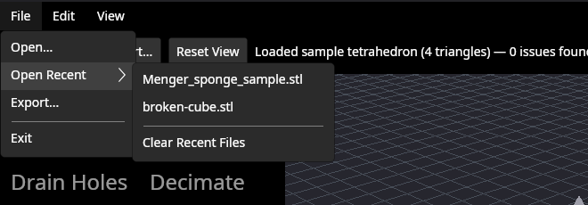
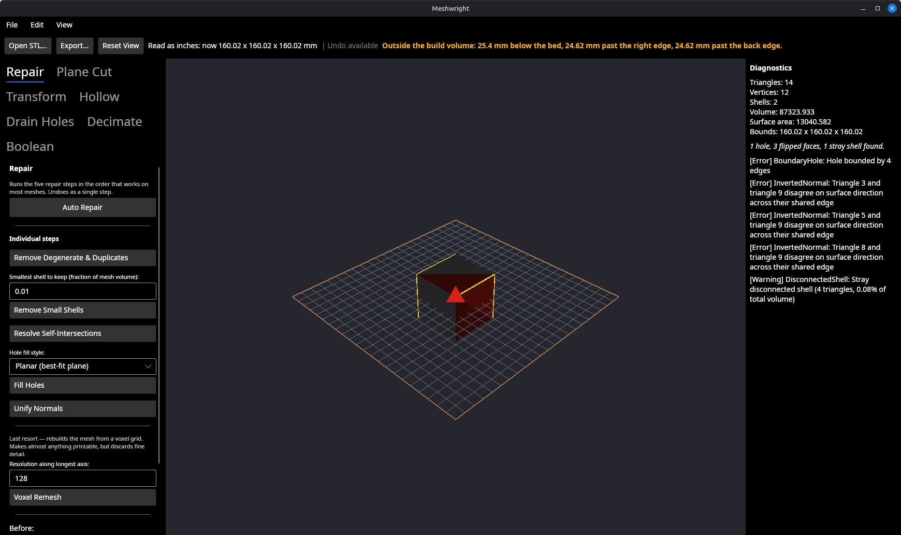
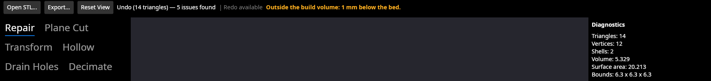
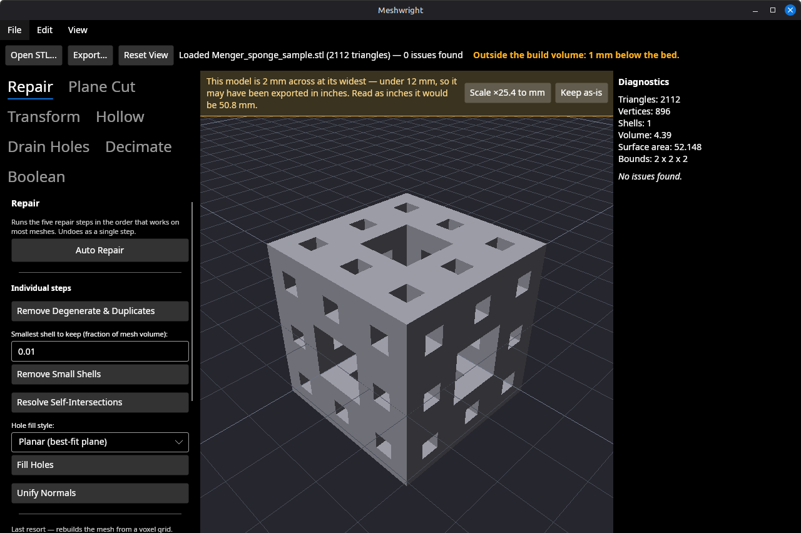
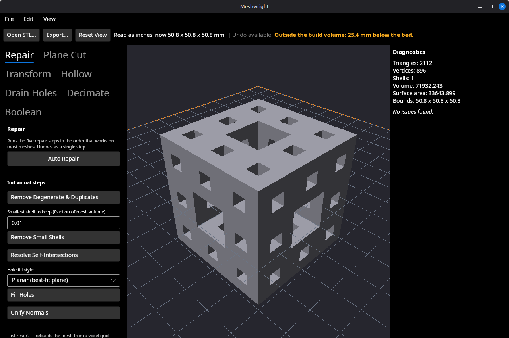
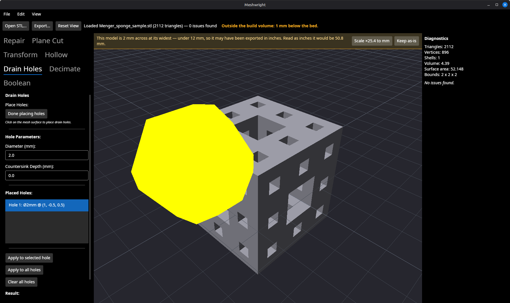
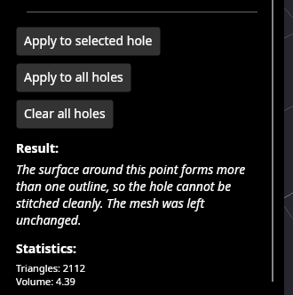

# Import conveniences — settings persistence, recent files, drag-and-drop, mm/inch

**Branch:** `feat/import-conveniences`
**Date:** 2026-09-06
**Backlog:** item 23's last slice (§5.1 Viewport / UX), plus item 27 and the
drain-hole refusal verification gap, both closed while the app was open.

**Suite:** 809 unit tests passing, 0 skipped (baseline was 742; this slice adds
67). GPU suite 28 passing, run under `timeout`.

---

## Summary

| Piece | State |
| --- | --- |
| `settings.json` in the platform config directory | Done, with four customers wired up |
| Recent files | Done, verified across a real restart |
| mm/inch detection and scaling | Done — **offered, never applied**; verified on two models |
| Drag-and-drop | Implemented and routed; **inert on Linux/X11 because Avalonia's X11 backend has no drag-and-drop at all** (measured — see below). Works on Windows and macOS, unverified there from this host |
| Item 27 (a refused operation counted as a change) | Fixed, with the drain-hole refusal path as the on-screen proof |

---

## 1. The settings file, built once for all its customers

`~/.config/meshwright/settings.json` (`%APPDATA%\meshwright\` on Windows),
plain `System.Text.Json`, per the 2026-09-06 decision. Four things wanted it and
three of them had already shipped as in-session fields carrying a comment saying
they belonged here:

```json
{
  "recentFiles": [
    "/home/bjorn/Downloads/Menger_sponge_sample.stl",
    "/home/bjorn/Code/meshwright/samples/broken-cube.stl"
  ],
  "buildVolumeName": "Prusa MINI (180 x 180 x 180)",
  "showBuildPlate": true,
  "window": { "x": 240, "y": 140, "width": 1280, "height": 820, "maximized": false },
  "offerUnitScaling": true
}
```

That is the real file, copied off disk after a session in which a printer was
picked from the View menu and the window was moved and resized. Everything about
it is deliberate:

- **Nothing in `SettingsStore` throws.** A read-only config directory, a file
  half-written by a machine that lost power, a JSON document someone edited
  badly — none of those are reasons the app should fail to start or fail to open
  a mesh. Each failure leaves a sentence in `LoadWarning`/`SaveWarning` that the
  window puts on the status line, because *silently* starting with defaults and
  *silently* discarding every change are the "reported success while being
  wrong" failures §11 catalogues.
- **The bed is stored by name, not by dimensions**, so correcting a preset's
  published size later reaches everyone who picked that printer rather than
  pinning them to the number that was wrong when they chose it. A name that
  matches no preset falls back to the default.
- **A window placement is only restored if it could be seen.** A 4×4 window, or
  one whose corner is a million pixels off the desktop, comes back invisible
  with no fix but finding and deleting the settings file, so `IsUsable` screens
  it out.
- **Only non-maximized geometry is recorded.** Avalonia does not expose a
  maximized window's restore bounds and reports the maximized geometry from
  `Position`/`Width`, so saving at close time would leave anyone who maximizes
  once with a window permanently the size of their screen.
- **The write is atomic** (sibling `.tmp` then `File.Move`), so an interrupted
  write leaves the previous settings intact rather than a truncated file that
  the next load has to report as corrupt.
- **Saved at each change, not at shutdown**, so a crash cannot lose the file you
  opened two minutes ago. The file is a few hundred bytes.
- `MESHWRIGHT_SETTINGS_FILE` overrides the location. The unit suite sets it from
  a module initializer, so 800-odd tests that each build a `MainWindow` can
  never read or rewrite the settings of whoever is running them.

The printer bed is now one of its customers — this menu selection is what wrote
`buildVolumeName` above, and it came back selected on the next launch:


## 2. Recent files

`File → Open Recent`, ten entries, most recent first, one entry per file
(re-opening promotes rather than duplicates), path-comparison case sensitivity
following the platform. Two files with the same name in different folders get
their folder appended so the menu stays useful; the full path is on the tooltip
either way. An entry whose file has gone says so and removes itself, and a file
that fails to open is dropped rather than being left at the top of the menu to
fail again every time it is picked.

This is the menu **after** closing the app and launching it again with no
arguments — the whole point of the settings file:



Clicking `Menger_sponge_sample.stl` there loaded it: 2112 triangles, bounds
2 × 2 × 2 (below). The tests end at the loaded geometry rather than at the status
text for the same reason.

## 3. mm/inch: the guess is offered, never applied

**An STL carries no units. Neither does an OBJ.** The number 25.4 appears
nowhere in either file, and no amount of reading one recovers what its author
meant — so "unit detection" is a guess about intent made from a bounding box,
and it can be wrong about a real part that really is 2 mm across.

**Decision: surfaced as a sentence next to a button; doing nothing is the
default.** Silently multiplying a model by 25.4 on open would be the most
expensive entry in §11: the model would look identical (the camera frames
whatever it is given), the triangle count would not move, the diagnostics would
be unchanged, and the only evidence would be an export measuring twenty-five
times too big. The bar states **both readings and the rule that produced the
question**, so a user whose part really is 4 mm can see in one line why they are
being asked and that the answer is no.

The rule: largest dimension under 12 mm, and at least 5 mm when read as inches.
12 mm is chosen from what the guess is *for* — below it the inch reading lands
between roughly 25 mm and 300 mm, the size of most things people print, and a
real part under 12 mm end to end is rare enough to be worth one dismissible
sentence. The lower bound stops the app offering a different wrong answer for
something too small to be a part either way.

`samples/broken-cube.stl`, opened from the command line. The bar is up and
**the mesh has not been touched** — Bounds still 6.3 × 6.3 × 6.3, no undo entry:


After pressing **Scale ×25.4 to mm** — bounds 160.02, the camera refits, the
build-plate warning re-evaluates against the new size, and it is on the undo
stack like any other change to the mesh:



`Ctrl+Z` puts it straight back, because accepting a guess has to be as
reversible as everything else — the guess can be wrong:



The same on the 2 mm Menger sponge, opened from the recent-files menu, on the
restored Prusa MINI bed:





The scale is applied **about the world origin, not about the model's centre**.
Reinterpreting a unit changes what every number in the file meant, including how
far the model sits from the origin; scaling about the centroid would leave a
part a CAD package placed 3 inches off centre sitting 3 mm off centre, which is
a different model from the one the file describes. There is a test for exactly
that, and it is why the sponge is now 25.4 mm below the bed rather than 1 mm —
the arithmetic is right and the consequence is honest.

The built-in sample tetrahedron is deliberately exempt: it is a 1-unit mesh
nobody chose to open, so asking about its units on every launch would be asking
a question with no answer. `offerUnitScaling: false` in settings switches the
bar off for someone who genuinely works in 2 mm parts.

## 4. Drag-and-drop — and the platform wall it hits on Linux

The handling is implemented and wired **to the `Window`**, not to
`MeshViewportControl`. That was the trap flagged in the handoff and it is real:
on Linux the GL surface does not reliably take part in Avalonia's input routing,
which is why `ViewportInputOverlay` exists to forward pointer events at all, so a
drop target attached to the viewport control would be attached to the one
control that never sees the event.

The tests raise the **real routed `DragDrop` events on the viewport's own
overlay**, so the event has to bubble up to the window's handler to be seen.
That test is load-bearing: moving the four `AddHandler` calls from `this` to
`Viewport` makes 8 of them fail, which is how it was checked rather than assumed.

A drop is accepted or refused **in words**, not just enacted — a window that
silently declines leaves the user guessing whether the app is broken, the file
is wrong, or the drag missed. A multi-file drop opens the first mesh and says
how many it ignored, because one document at a time is the v1.0 model.

### It cannot work on Linux/X11 today, and that is Avalonia, not this code

Driving a real GTK drag source across the running app produced nothing: no
hint, no load, no status change, and the source's own `drag-data-get` never
fired, meaning the target never accepted. Three measurements, in order:

1. **`xprop` on the running window has no `XdndAware` property at all.** Every
   other window on the same desktop has one (GTK, Electron, Firefox). Avalonia
   never advertises the window as a drop target, so no X11 drag source will even
   offer it a drop.
2. **Setting `XdndAware` by hand did not help.** With the property forced onto
   the window, the same GTK drag reached `drag-begin` and then `drag-end` with
   no data transfer — the app receives the XDND `ClientMessage`s and discards
   them, because nothing is listening for them.
3. **`Avalonia.X11.dll` contains no drag-and-drop implementation.** Scanning
   every Avalonia assembly in the package cache, the platform drag-drop types
   appear in `Avalonia.Win32`, `Avalonia.Native` (macOS) and
   `Avalonia.Headless` — and not in `Avalonia.X11`, which has no XDND atoms and
   no drag types of any kind.

So on Windows and macOS this code is the correct handler and should work; on
Linux/X11 external drops cannot reach any Avalonia application. I have not
verified the Windows or macOS behaviour — there is no such host here — so the
honest claim is "implemented, routed, and tested at the Avalonia layer; blocked
below it on Linux".

**What it would take** is filed as backlog item 29: an XDND receiver of our own
on Linux — an `InputOnly` X11 child window over the toplevel carrying
`XdndAware`, on our own display connection, handling `XdndEnter`/`Position`/
`Drop` and `XConvertSelection` for `text/uri-list`. That is platform work with a
real risk to the viewport's primary input path, which is why it is not in an
"import conveniences" slice. Until then the README, the site and the app say
Linux users should use `File → Open`, `File → Open Recent`, or the command-line
path argument.

## 5. Item 27: a refused operation no longer counts as a change

`MeshDocument.ApplyAsync` called `RefreshReport` unconditionally, so an
operation returning `Changed: false` — every refusal path — still pushed an undo
step, still cleared the redo stack, and still made the window rebuild every
gizmo and empty its gizmo slot. The user-visible cost was losing a pin, or a
drain hole, that they had positioned by hand, while being told it could not be
placed.

The fix is in `UndoStack` and `MeshDocument`: the snapshot is now **captured**
before the operation (it has to be — operations mutate in place) and only
**committed** if the operation says it changed something. A refusal leaves both
stacks exactly as they were and raises nothing.

This also closes the drain-hole refusal path's verification gap, which had two
tests and no on-screen evidence. A 2 mm hole placed on the 2 mm Menger sponge:






Suppressing the refresh deliberately does **not** suppress the explanation: the
result is returned to the caller either way and it is the panel that shows it.
There is a test for that, so a future "simplification" cannot make refusals
silent.

## 6. Tests

67 new tests, all of which fail against the code they were written for:

- `Settings/SettingsStoreTests` — round trip; a missing file; a file from an
  older version with an unknown key; a corrupt file (defaults **plus** a
  warning naming the path); valid JSON of the wrong shape (`null`, which
  deserializes to null rather than throwing); an unwritable location; no `.tmp`
  left behind; the environment override; the default location's shape.
- `Settings/AppSettingsTests` — ordering, promotion on re-open, two spellings of
  one path counting once, relative paths stored absolute, the cap, and the
  window-placement sanity floor.
- `Units/ImportUnitsTests` — the rule and both its edges, a 200 × 1 × 1 model
  (not an inch file — taking X, the diagonal or the volume each gets a
  different case wrong), and the message carrying both readings.
- `ImportConveniencesTests` — the menu, the persistence across a second window,
  clicking an entry ending at the loaded geometry, a deleted file, a file that
  fails to open, the bed and plate switch surviving a restart, an unknown
  printer name, a remembered window size, a nonsense one being ignored, the drag
  events bubbling from the viewport overlay, the uri-list form, a multi-file
  drop, and the unit offer's whole life including that an ordinary import says
  **nothing at all**.
- `RefusedOperationTests` — item 27 on both the sync and async paths, including
  that a refusal between an undo and a redo does not throw the redo away, and a
  guard that operations which *do* change the mesh are still undoable.

## 7. What the next slice inherits

- **`settings.json` exists now.** A free-form custom bed size, a remembered
  display mode, a remembered cross-section axis — anything that wants to outlive
  a session adds a property to `AppSettings` and is written by whoever changes
  it. Nothing here throws and every value has a default, so a new property costs
  one line.
- **Avalonia's X11 backend has no drag-and-drop, in either direction.** If a
  future feature wants an in-app drag (reordering, dragging a mesh onto the
  Boolean panel's second slot), it will not work on Linux either. Measured, not
  assumed — see §4 above.
- **A refusal is now genuinely free.** Anything that returns `Changed: false`
  costs the user nothing: no undo entry, no gizmo rebuild, no lost placement.
  New operations should return that rather than throwing or returning
  `Changed: true` with an apologetic summary.
- **`DataTransferItem`/`IDataTransfer` is the current Avalonia API**;
  `IDataObject` and `DragEventArgs.Data` are obsolete in 11.3.20 and produce
  warnings. `IStorageFile` cannot be implemented by application code (the
  interface carries a member literally named "This interface or abstract class
  is -not- implementable by user code !"), so a test that needs one reaches
  Avalonia's internal `BclStorageFile` by reflection — the same type the desktop
  backends wrap a real path in.
