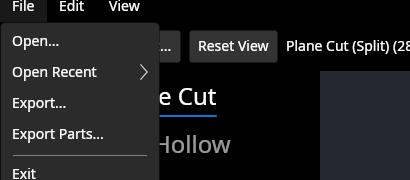
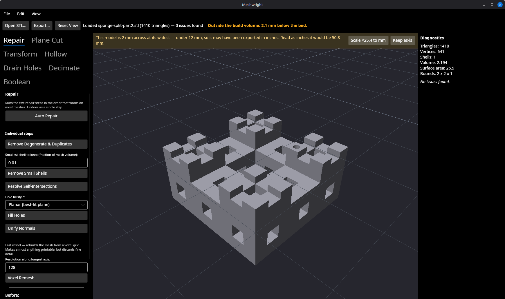

# Splitting a model leaves two printable parts (backlog item 26)

**Date:** 2026-09-07
**Branch:** `fix/split-separate-halves`
**Suites:** 824 unit tests passing, 0 skipped; 28 GPU tests passing.

## The defect

`PlaneCutSplitOperation` appended the negative half into the same `DMesh3` as the
positive one, leaving the two caps in exactly the same plane over exactly the
same area. Every cap triangle overlapped its opposite number.

Splitting the clean Menger sponge sample at its centre — a model that opens with
**0 issues** — reported **1,808**:

Each half measured on its own was closed, single-shell and issue-free. The merge
invented all 1,808. Two solids sharing a face are also not two printable parts:
a slicer handed that file fuses them back into the model the user just cut up.

## The decision: separate the halves, do not split the document

Item 26 offered two fixes, and they are different products.

**Making a split produce two documents** would change the app's single-document
model — `MeshDocument`, the one undo stack, the one viewport upload, the Boolean
panel's from-a-file secondary mesh and Export all assume exactly one mesh. That
is a milestone-sized change, and it also has no obvious undo semantics: undoing
"produced a second document" is not a mesh edit.

**Separating the halves inside one mesh** is the fix taken here. Its weakness is
real — the user is left with one file holding two solids — so the slice closes
that too, with **File → Export Parts**, which writes one file per shell. The
deliverable is what the workflow actually needs: two printable parts that still
line up.

The separation is a **pure translation along the cut normal**, which is what
keeps registration pins meaningful: translating the negative half back by the
gap reproduces the original bounding box exactly, so the halves still mate.

### The gap

    separation = peg protrusion + max(1 mm, 5% of the model's extent along the cut normal)

- **1 mm floor.** A slicer only treats two solids as two objects if it can get a
  nozzle between them; 0.8 mm is the widest nozzle in common use.
- **5% of the extent**, so the gap reads the same on a model of any size — a
  millimetre is half the 2 mm Menger sponge and invisible beside the 120 mm
  Eiffel tower.
- **Plus the peg**, because a registration peg stands proud of its mating face
  and is still buried in its socket until the halves are pulled apart by at least
  its own length. A gap chosen without it would leave the halves
  interpenetrating — the exact defect this fix exists to remove, visible only
  when a pin is asked for.

## After

The diagnostics panel side by side, before and after, on the same operation:

### Two things came out from under the fix

**Inspect called half the model debris.** `DisconnectedShellDetector` reported
every non-largest shell as a "Stray disconnected shell" at Warning severity, so
the second half arrived described as 50% of the model's volume that wants
cleaning up. A shell at or above **1% of total volume** — the same threshold
Auto Repair uses to decide what it may delete, so the two cannot drift apart —
is now a `SeparatePart` at **Info** severity. Real debris is still a Warning, and
a test pins that.

**The viewport painted it red.** The status line said "0 issues found" while the
whole lower half rendered in the defect colour, because `MeshViewportControl`
highlighted every finding rather than every *defect*. The picture contradicted
the words next to it. Highlighting now reads `MeshDiagnosticsReport.Defects`.
This was found by running the app after the suite was green — the fourth time in
five slices that the only evidence was on screen.

## Registration pins still mate

Bounds after the pinned split read **2 × 2 × 3.1** — the model's 2 mm plus the
1 mm floor plus the 0.1 mm peg — and the status line reads 0 issues.

## Export Parts

Reopening one of the two files the app just wrote:

Export Parts refuses up front on a single-part model — "This model is a single
part — use File → Export." — rather than asking for a filename and then writing
one misleadingly-named `-part1` file.

## What the tests assert

The invariant is **not** that the issue count went down. A test checking "fewer
issues than before", or `TriangleCount > 0`, passes just as happily for a fix
that quietly drops one half — the failure mode §11 records for this operation
twice already. `PlaneCutSplitSeparationTests` therefore measures **each half on
its own**, after decomposing the result with the new `MeshShells.Separate`:

| Assertion | Why it is the one that matters |
| --- | --- |
| Each half has no boundary loops | Closed. A dropped or damaged half is not. |
| Each half has shell count 1 | Neither half secretly carries part of the other. |
| Each half has `DefectCount == 0` | The claim item 26 makes about the halves. |
| The halves' volumes sum to the original, to 6 dp | Nothing was dropped and nothing was double-counted. |
| Each half is 40–60% of the original volume | Rules out "one half plus a sliver". |
| Gap ≥ 1 mm, and exactly 1 mm on the 2 mm sponge, exactly 10 mm on a 200 mm one | The floor and the 5% term, separately. |
| Re-mated bounding box equals the original's to 9 dp | The separation is a translation along the normal alone, so the halves still line up. |
| With a pin: gap **strictly greater** than the measured peg protrusion | The case a gap chosen without the pin gets wrong. |
| The merged mesh carries no `SelfIntersection`, `NonManifoldEdge` or `DuplicateVertex` | The 1,808, named by category. |
| `Highlights(report)` is empty on a split model, non-empty on `BrokenSample.stl` | The red-half defect, with its control. |

Plus `MeshExporterTests` on the written files (one shell per file, correct
volumes, format from the base name) and `MainWindowTests` end to end through the
window.

## Files

- `src/Meshwright.Core/Operations/PlaneCutSplitOperation.cs` — the separation.
- `src/Meshwright.Geometry/Edit/MeshShells.cs` — new; one mesh per shell,
  largest first. Shared by Export Parts and the tests, so both agree on what a
  part is.
- `src/Meshwright.Geometry/Diagnostics/DisconnectedShellDetector.cs` — parts vs
  debris.
- `src/Meshwright.Geometry/Diagnostics/MeshDiagnosticsReport.cs` — `Defects`,
  `DefectCount`, and a Summary that reports notes separately from defects.
- `src/Meshwright.App/Views/MeshViewportControl.cs` — highlight defects only.
- `src/Meshwright.IO/MeshExporter.cs`, `src/Meshwright.App/MainWindow.axaml[.cs]`
  — Export Parts.

## Left open

- The gap is not user-adjustable. It is stated in the result message and undoing
  the cut restores the model, which seemed enough; a knob can follow if anyone
  wants a specific exploded distance.
- Export Parts writes `-partN` siblings without asking about each one, so it can
  overwrite an existing `-part2` file that the picker never mentioned.
- The halves separate **along the cut normal**, not laid out flat on the bed.
  Arranging parts on the plate is a feature this app does not have; the slicer
  does it.
