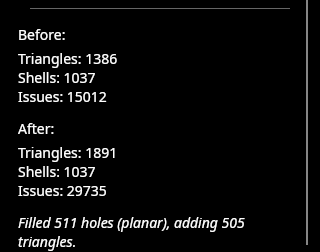
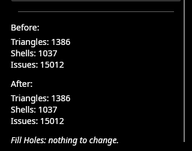

# Hole filling and hole detection now agree about import seams (backlog item 24)

**Date:** 2026-09-07
**Branch:** `fix/hole-fill-seams`
**Suites:** 830 unit tests passing, 0 skipped; 28 GPU tests passing.

## The defect

`DMesh3` cannot represent an edge shared by more than two triangles, so on a
non-manifold file the importers keep the geometry by **cutting the connectivity**
— duplicating vertices at the junction. The surface stays complete; the indexing
no longer says so. Every cut leaves a pair of boundary loops sitting on top of
each other.

`BoundaryHoleDetector` knew that: it ignored loops made entirely of seam edges,
found by comparing edge *positions* (`PositionTopology.SeamEdges`).
`HoleFillRepair` did not: it walked `MeshBoundaryLoops` directly, which is
vertex-index based and has no such notion. So Inspect could correctly report a
mesh as having no holes, and Fill Holes — and Auto Repair, which runs it — would
then drape new geometry across the seams.

This is not a corner case. Of the 24 corpus files with Thingi10K ground truth,
**14 carry boundary loops that are import seams rather than holes**; one carries
13,348 of them on a mesh with no holes at all.

## Before and after, in the running app

`tests/corpus/files/thingi10k-92067.stl` — 1,386 triangles, 15,012 issues, and
**not one of them a hole**: the diagnostics summary lists non-manifold edges,
self-intersections, flipped faces, degenerate triangles and duplicate vertices,
and no holes at all.


Pressing **Fill Holes** on that model, before the fix:



After the fix, the same click on the same file:




## The fix

One method, asked by both sides:

```csharp
PositionTopology.OpenBoundaryLoops(mesh)   // every boundary loop, minus those made entirely of seams
```

`BoundaryHoleDetector` and `HoleFillRepair` now both call it, so what Inspect
reports and what Fill Holes fills are the same set **by construction** rather
than by two implementations agreeing. That is the whole shape of the fix: the
bug was not that either rule was wrong, it was that there were two of them.

A loop with any genuinely open edge is still a hole and is still returned
**whole**, seam edges included — what the surface is missing there is bounded by
the entire loop, not by the open part of it. The detector already behaved that
way; the filler now matches.

## What the tests assert

- `ImportSeamHoleFillTests` — a cube whose top face has been detached by
  duplicating its four corners, which is exactly what the importer leaves behind.
  The fixture is first asserted to be the thing it claims to be (two boundary
  loops, every edge of both a seam), then: detection reports no hole, and filling
  in **all three modes** adds no triangle and no vertex. On the old code all
  three fail, filling 2 holes and adding 4–8 triangles — a second lid draped over
  the lid the model already had.
- `CorpusGroundTruthTests.HoleFillingFillsExactlyTheHolesInspectReports` — over
  every corpus file with ground truth, the number of holes `HoleFillRepair` fills
  must equal the number `BoundaryHoleDetector` reports. It also asserts that at
  least one corpus file *has* a seam-only loop, so the test cannot quietly become
  vacuous if the corpus is ever thinned; 14 of 24 do today.

Both were run against the pre-fix code and fail there — four failures across the
two — which is what makes them guards rather than decoration.

## Not changed

Plane cut's cap generation does not go through `HoleFillRepair.Fill`, so capping
is unaffected; the cut-cap tests, which assert cap triangle counts exactly, pass
unchanged. A drain hole's boundary is genuinely open, not a seam, so Auto Repair
still fills it back in — the documented behaviour that tells users to drill last.

## Left open

Import seams remain in the mesh. Nothing welds them back, and Inspect still
reports the non-manifold junction that caused them (correctly — it is in the
file). This slice makes repair stop *acting* on the artefact; it does not remove
the artefact.
