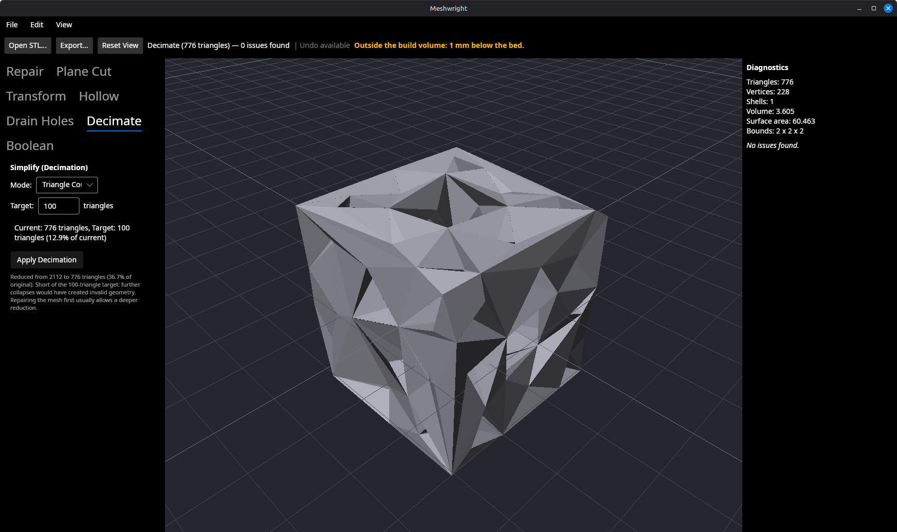
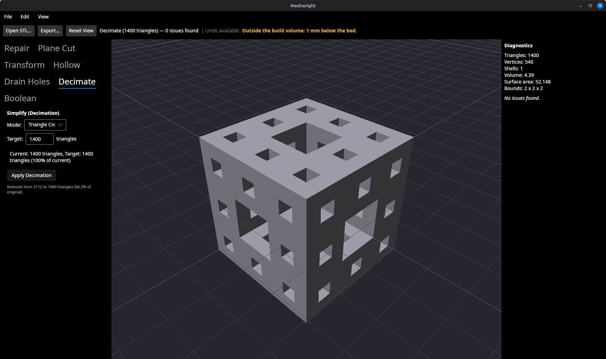
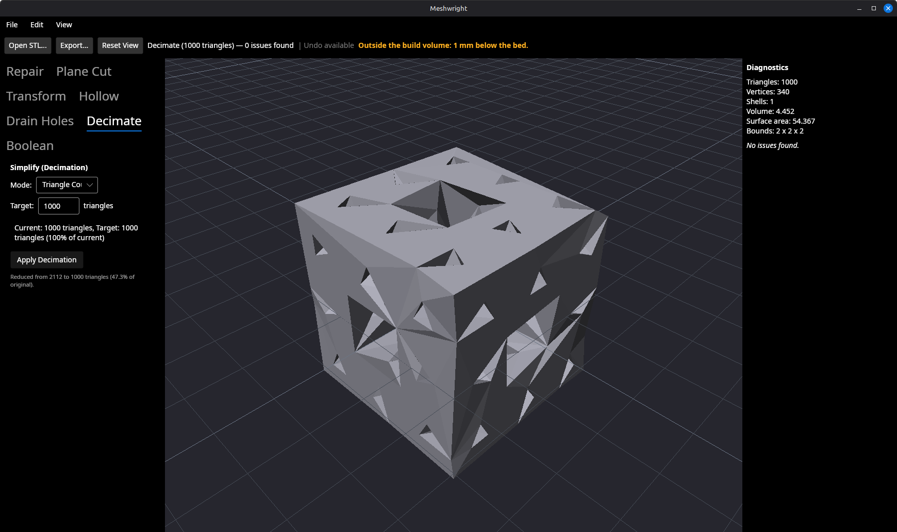

# Decimation introduced the invalid geometry it said it had declined to create

**Backlog item 22.** Branch `fix/decimate-validity`. 2026-09-07.

## The bug

Reducing the clean Menger sponge sample to a 100-triangle target stopped at 736
triangles and left **32 self-intersections in a mesh that had none**, while the
Decimate panel reported that further collapses "would have created invalid
geometry" and the status bar counted the 32 in the same frame.

Worse cases were one keystroke away. A 1,400-triangle target — a reduction the
mesh reaches comfortably — came back with **58 defects across four categories**
and an unqualified success message, no caveat of any kind:

## Cause

`Reducer`'s per-collapse validity test is `collapse_creates_flip_or_invalid`,
which walks the one-ring of each endpoint looking for a face-normal flip or a
violated link condition. Both are local properties of the edge, and **not one of
the four defect categories above is a local property**:

| Defect the decimation added | Why the one-ring cannot see it |
| --- | --- |
| Self-intersection | The two triangles that end up crossing are on opposite walls of the model and share no vertex |
| Degenerate triangle | The area threshold is scale-relative to the whole mesh, and grows as decimation proceeds |
| Duplicate vertex location | The kept vertex lands on a vertex that is nowhere near it in the connectivity graph |
| Non-manifold edge | Follows from the duplicate: `PositionTopology`, and so Inspect, measures topology by position, not by index |

The reducer had refused exactly the collapses it could see, and made the rest.
The message was not a lie about the collapses it refused — it was a claim about
collapses it had never examined.

Nothing about the reducer's configuration fixes this. Turning off
`MinimizeQuadricPositionError` (collapsing to an endpoint rather than the
quadric-optimal point) removes the degenerate/duplicate/non-manifold family but
makes the self-intersections worse — at a 100-triangle target, 100 of them
instead of 32.

## What "valid" is checked against, and when

Two routes were available and both are defensible. This slice took the second.

**Rejected: run `ResolveSelfIntersectionsOperation` after every decimation.** It
is the cheap fix and it is genuinely available — the operation exists and works.
It was not taken for two reasons. It would change the geometry the user asked to
*simplify*, silently, as a side effect of a different operation; and it treats
the symptom, leaving decimation still making collapses it has no business making
and still describing them incorrectly. It would also do nothing for three of the
four defect categories above.

**Taken: reject the collapse, against a whole-mesh invariant.**
`ValidatingReducer` implements a new `Reducer.CollapseIsGloballyValid` hook.
Before each collapse, the triangles it would reshape are built in their
hypothetical post-collapse form and tested against the rest of the mesh; a
collapse that would add a defect is refused, and the reducer moves on to the next
edge exactly as it does for a normal flip.

Three properties of that design are load-bearing:

- **Every test is asked of the detector that would report the defect.**
  `DegenerateTriangleDetector.AreaEpsilonFor`,
  `DuplicateVertexDetector.IsCoincident` and `SelfIntersectionSearch`'s
  degenerate exclusion are now public and called from the guard. This is the
  hole-fill lesson from the day before (item 24): the bug there was not that
  either rule was wrong, it was that there were two of them.
- **Only *new* defects are refused.** A collapse in a region that already
  self-intersects, or one reshaping a triangle that was already degenerate, still
  goes ahead. Demanding validity a mesh never had would leave an already-broken
  scan — the common case for the users this tool exists for — barely decimated.
- **The broadphase is allowed to go stale, deliberately.** Rebuilding an AABB
  tree per collapse would dominate the run. A collapse only ever moves the vertex
  it keeps, so every triangle *not* in the dirty set still has exactly the
  geometry the tree was built over and its stored box is exact; the moved
  triangles are held in a small dirty set (with a coarse grid over it) and tested
  directly. Nothing downstream trusts a stored box — every candidate is re-read
  from the live mesh before it is tested.

The vendored `Reducer` gains one hook, recorded in
`src/Meshwright.Geometry/Vendor/g3/VENDOR.md`. Its default implementation returns
`true`, so an unmodified `Reducer` is byte-for-byte upstream in behaviour.

## Result

The mesh's honest floor moved from 736 triangles to 776 — 5% less reduction, in
exchange for the reduction being real. Every target the sponge could already
reach it still reaches **exactly**:

### Sweep across 21 targets, bare reducer vs guarded

Both columns start from the same clean 2,112-triangle sponge (0 defects).

| Target | Bare: triangles / defects | Guarded: triangles / defects |
| ---: | --- | --- |
| 100 | 736 / **32** (SelfIntersection) | 776 / **0** |
| 200–700 | 736 / **32** | 776 / **0** |
| 800 | 800 / **15** | 800 / **0** |
| 900 | 900 / **13** | 900 / **0** |
| 1000 | 1000 / 0 | 1000 / 0 |
| 1100 | 1100 / **2** | 1100 / **0** |
| 1200 | 1200 / **2** | 1200 / **0** |
| 1300 | 1300 / **14** | 1300 / **0** |
| 1400 | 1400 / **58** | 1400 / **0** |
| 1500 | 1500 / **36** | 1500 / **0** |
| 1600 | 1600 / **30** | 1600 / **0** |
| 1700 | 1700 / **34** | 1700 / **0** |
| 1800 | 1800 / **36** | 1800 / **0** |
| 1900 | 1900 / **34** | 1900 / **0** |
| 2000–2100 | reached / 0 | reached / 0 |

**15 of the 21 targets came back broken before; none does now**, and the only
target whose triangle count changed at all is the one the mesh could not honestly
reach anyway.

### Across the corpus

`tests/corpus/files/` is fetched on this machine and gitignored, so this is a
local measurement. Every corpus mesh between 16 and 20,000 triangles (29 files)
decimated to 50%, bare reducer against guarded:

- **8 files load defect-free.** The bare reducer broke **1** of them
  (`fandisk.obj`, 0 → 4 defects). The guard broke **0**.
- **28 of the 29 land on the identical triangle count** under both. The
  exception is `beetle.obj`: 1,025 bare, 1,026 guarded — one triangle.
- `thingi10k-92067.stl` (1,386 triangles, 1,037 shells, 15,012 issues) reduces by
  nothing under either. Not a regression; it could not be decimated before.

One honest caveat, visible in the same run: on meshes that arrive broken the
guard sometimes leaves a *higher* defect count than the bare reducer
(`lg-camel_b.obj`, 1,450 against 692). The bare reducer's collapses happen to
destroy some pre-existing bad geometry along with everything else. The guard is
not a repair and does not claim to be one — it refuses to add defects, which is a
different promise from removing them. Auto Repair is the operation for that.

### Cost

The guard is not free. Measured on this machine:

| Mesh | Target | Bare | Guarded |
| --- | --- | ---: | ---: |
| Menger sponge, 2,112 tris | 100 | 90 ms | 1.9 s |
| Menger sponge, 2,112 tris | 1,000 | 8 ms | 0.28 s |
| Eiffel tower, 139,989 tris (36,708 issues) | 50% | 1.3 s | 23 s |
| Eiffel tower, 139,989 tris | 10% | 1.1 s | 39 s |

The cost is concentrated in exact triangle-triangle tests, and the tower is the
worst case in the repo: it is both large and already riddled with
self-intersections, so the guard pays for a second "was it already intersecting?"
test all over the model. Four rounds of optimisation took the tower from 217 s to
this: one broadphase query per collapse rather than per reshaped triangle, a
dirty-set scheme replacing displacement-padded stale queries, a grid over the
dirty set with a cell budget that falls back to a linear scan for wide boxes, and
reusing the intersection-test object instead of allocating millions of them.

Decimation runs through `MeshDocument.ApplyAsync` on a background thread with a
progress spinner, so §6.4's "UI thread blocked per operation < 100 ms" is
unaffected, and §6.4 sets no target for simplification itself. A user simplifying
a 140k-triangle model now waits half a minute. That is a real cost and it is
recorded in `docs/usage.html`; making it cheaper is worth its own slice, and the
obvious lever is parallelising the candidate tests.

## Correcting the record

The backlog entry and one of the two notes in `docs/usage.html` said **734
triangles and 67 self-intersections**. The measured figures, both from the
running app (screenshot above) and from the shipping code path, are **736 and
32** — which is what `docs/usage.html` §5 already said. The 734/67 pair traces
back to the 2026-09-06 decision-log row; the "67 self-intersections" figure also
appears in `DrainHoleTests` attributed to that row, so it may have been carried
across from the drain-hole audit of the same day. It does not reproduce on any
target: no reduction of this mesh lands on 734 triangles at all.

Corrected in `SPECIFICATION.md` (item 22 and the §11 row), `docs/usage.html` §11,
and left alone in `docs/usage.html` §5, which was right.

## Tests

`tests/Meshwright.Tests/Edit/DecimateValidityTests.cs` — 13 tests on a CI-safe
synthetic fixture (a thin-walled slab: two sheets of surface a short distance
apart, the sponge's defining property without a downloaded file). Both halves are
pinned, deliberately:

- `AMeshThatWasValid_IsStillValidAfterDecimating` at four fractions — the
  invariant, measured by the whole-mesh detectors via `DefectCount`.
- `ATargetTheMeshCanReach_IsStillReachedExactly` and
  `APercentageTargetOnAMeshWithRoomToLose_IsStillMet` — the half that a
  "stop earlier" fix destroys. A decimator that decimates nothing passes every
  validity assertion perfectly.
- `TheFixtureStillReproducesTheBug_WithoutTheGuard` — asserts the bare `Reducer`
  still breaks this fixture. Without it, the validity tests would pass vacuously
  the day the fixture stops reproducing the bug, and the regression could return
  unnoticed.
- `AnAlreadyBrokenMesh_StillDecimates` — pins the "only new defects" decision.

`tests/Meshwright.Tests/Corpus/CorpusDecimateValidityTests.cs` — the corpus-wide
version, with the second assertion the hole-fill slice asked for: it fails if the
corpus no longer contains a single defect-free file under the size ceiling, so
thinning the corpus turns the test red rather than vacuous.

## Suite

- Unit: **844 passing, 0 skipped** (830 before this slice + 14 new).
- GPU: **28 passing**, run under `timeout`.
- No test newly skipped.
